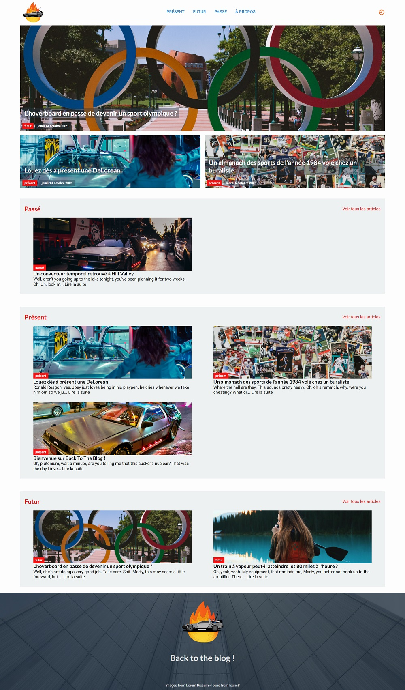
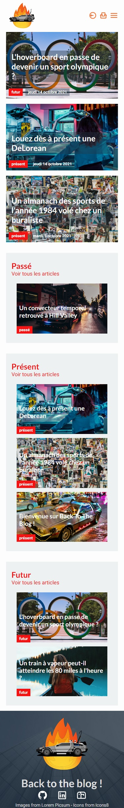
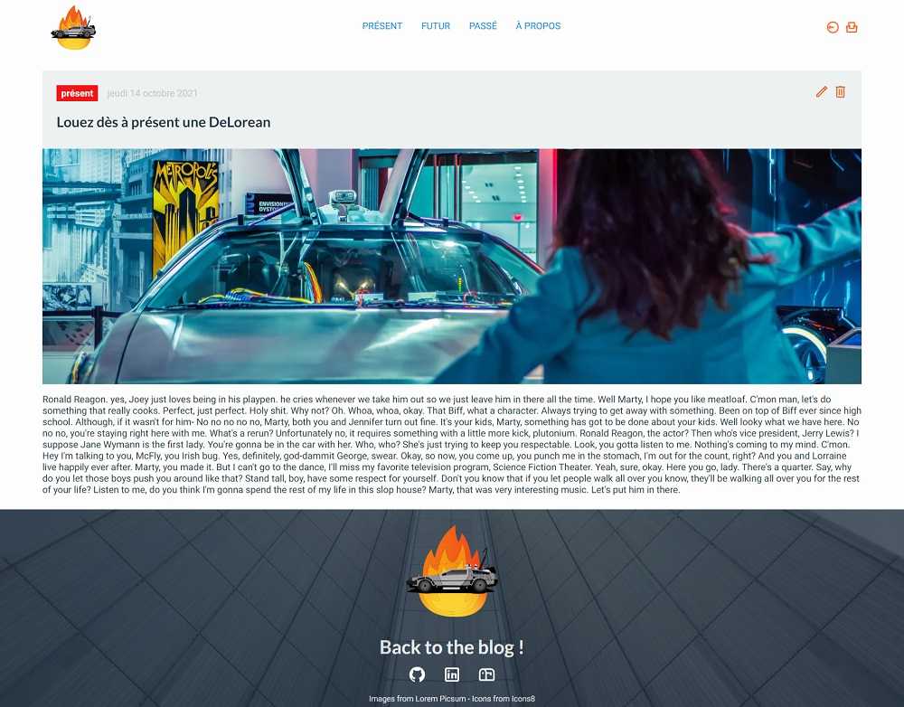
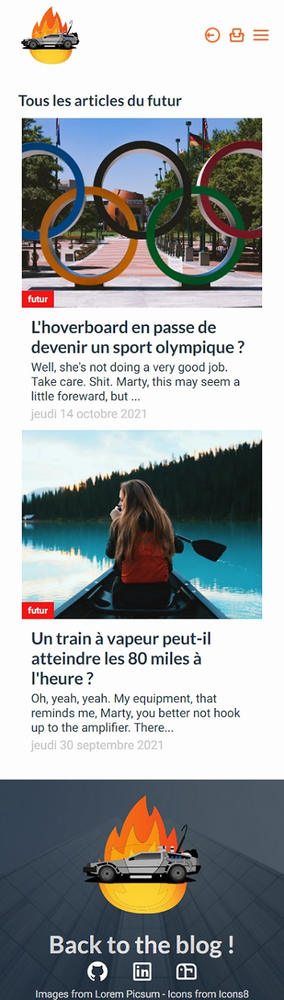

# Back to the blog - un faux blog créé avec Next.js et Firebase

En tant que développeur (junior à l'heure actuelle en 2021), il est toujours utile et intéressant de découvrir de nouvelles technologies et méthodes de travail à acquérir dans mon bagage de connaissances 💼.

Dans ce projet, j'ai souhaité me tourner vers l'apprentissage du framework **[Next.js](https://nextjs.org/)** pour créer un faux blog et m'intéresser de plus près à ce que peut m'apporter l'usage d'un outil orienté vers le référencement et l'optimisation d'une Single-Page Application. J'alimenterais ce blog avec Google Firebase (authentification, données, ...) et faire de l'intégration continue avec Vercel App.

La thématique sera autour de la trilogie "Retour vers le futur" (clin d'oeil à la promo McFly O'Clock 2020 😉) et aux acteurs du film mais je ne pense pas qu'ils viendront un jour sur ce repo mais sait-on jamais 😅 !

**CE PROJET EN COURS DE CONSTRUCTION** - dernière mise à jour de ce document : 14 octobre 2021

## Sommaire

- [Back to the blog - un faux blog créé avec Next.js et Firebase](#back-to-the-blog---un-faux-blog-créé-avec-nextjs-et-firebase)
  - [Sommaire](#sommaire)
  - [Présentation](#présentation)
    - [Le projet](#le-projet)
    - [Screenshots](#screenshots)
    - [Liens](#liens)
  - [Mon procédé](#mon-procédé)
    - [Construit avec](#construit-avec)
    - [Ce que j'ai appris](#ce-que-jai-appris)
    - [Difficultés rencontrées](#difficultés-rencontrées)
    - [Ressources](#ressources)
  - [Auteur](#auteur)

## Présentation

### Le projet

Les utilisateurs sont capables de :

-   Consulter une liste d'articles sélectionnés sur la page d'accueil ✅
-   Consulter un article ✅
-   S'identifier et créer un article à publier directement par l'interface ✅
-   Consulter une page comprenant les articles selon la catégorie sélectionnée ✅
-   Laisser un commentaire sur la page d'un article (prochainement 🤙)
-   Créer un compte et proposer des articles à la rédaction du blog (prochainement 🤙)

L'administrateur est capable de :
- Rédiger un nouvel article ✅
- Modifier ou supprimer un article publié ✅

### Screenshots

**Page d'accueil**

Version desktop 👇

Version mobile 👇

**Page d'article** 👇

**Page d'articles par catégorie** 👇

**Page de rédaction / édition d'un article** 👇

### Liens

-   Repo GitHub : [github.com/OlivierZiolkowski](https://github.com/OlivierZiolkowski/back-to-the-blog)
-   Live Site URL : [Déploiement sur Vercel](https://back-to-the-blog.vercel.app/)

## Mon procédé

### Construit avec

-   [Next.js](https://nextjs.org/) - Framework destiné à gérer le routage, l'optimisation et le référencement d'une application React
-   [React](https://reactjs.org/) - Librairie JS
-   [Google Firebase](https://restcountries.eu/) - pour les données authentification
-   [Vercel App](https://vercel.com) - pour l'hébergement
-   [Formik](https://formik.org/) - création de formulaires
-   [Yup](https://github.com/jquense/yup) - validation des champs de formulaire
-   [SASS](https://sass-lang.com/) - pour le style
-   [CSS Modules](https://github.com/css-modules/css-modules) - pour le style
-   [Webpack](https://webpack.js.org/) - Bundler
-   [Babeljs](https://babeljs.io/) - Transpiler
-   [ESLint](https://eslint.org/) - Linter
-   [Prettier](https://prettier.io/) - Formatter

### Ce que j'ai appris

 - **Next.js** :
   - Utilisation du framework Next.js
   - Mise en place du projet et de son architecture (dossier Pages pour implémenter le routage de l'application) ;
   - Utilisation des hooks `getServerSideProps()` et `getStaticProps()` pour faire des appels de données dynamiques et / ou statiques ;*
   - Utyilisation des commandes de routage et de liens pour parfaire la navigation ;
   - Implémentation des composants Next.js pour le référencement et l'optimisation du contenu ;
   - Utilisation de l'optimisation d'images avec le composant `next/image` permettant un chargement de l'image.

- **Firebase** :
  - Création d'un projet sous Firebase ;
  - Ajout & création de données dans FireStore (NoSQL) ;
  - Authtentification par e-mail / password via "Authentication";
  - Stockage des images sur le serveur Firebase Storage.

- **Vercel App** :
  - Hébergement de l'application ;
  - Intégration continue via le versionning depuis GitHub.

- **Formik & Yup** :
  - Création d'un formulaire via Formik qui offre un gain de temps avec des méthodes permettant de récupérer et vérifier le contenu d'un champ de formulaire ;
  - En complément, Yup vient valider chaque champ selon un pattern défini en amont du formulaire.

- **Autres** :
  - Utiliser le champ de formulaire de type "file" et l'objet File pour récupérer un fichier.

### Difficultés rencontrées

- **Firebase** :
  - Cette application tourne sous Firebase version 9 et utilise le cloud FireStore pour récupérer des données. Je me suis un peu perdu pour essayer de trouver la meilleure solution pour récupérer les informations relatives à un seul article selon son `slug`. Découvrant le NoSQL et Firebase simultanément, il semble que, sans un ID, on ne puisse récupérer une donnée unique. J'ai donc fait une requête de plusieurs documents que je reserre avec deux paramètres : le document doit avoir un slug égal à celui passé en paramètre de ma fonction et le document doit être considéré comme mis en ligne. Je renvoie un résultat sous forme d'objet que je peux ensuite utiliser dans la page d'article. **EDIT[11/10/2021]**: il est effectivement possible de récupérer l'ID auto-généré d'un document en l'intégrant à mon post.
  - Firebase étant du NoSQL, j'ai encore des "réflexes" de création de tables en SQL et je me suis confronté lors de la construction de ce projet à devoir réfléchir différemment lors de la construction de ma base de données en ligne notamment sur les liens entre les tables en SQL et la constitution d'une suite de collections indépendantes en NoSQL.

### Ressources

-   [Documentation de Next.js 📕](https://nextjs.org/docs/getting-started)
-   [Documentation de Firebase 📗](https://firebase.google.com/docs)
-   [Documentation de Formik 📘](https://formik.org/docs/overview)
-   [Tutoriel de Ashlee M. Boyer pour créer un blog de base via Next.js et Firebase 👍](https://ashleemboyer.com/series/nextjs-firebase-blog)
-   [StackOverflow évidemment 😅](https://stackoverflow.com/)
-   [Inspiration graphique - Louis Magazine 👌](https://www.louismagazine.com/)
-   [Récupérer un fichier avec File - MDN](https://developer.mozilla.org/fr/docs/Web/API/File)

## Auteur

-   Compte GitHub : [Visitez ma page 😀](https://github.com/OlivierZiolkowski)
-   LinkedIn : [Ajoutez-moi 🤙](https://www.linkedin.com/in/olivier-ziolkowski/)
-   Mail : [Écrivez-moi ⌨](mailto:olivier.ziolkowski@gmail.com)
